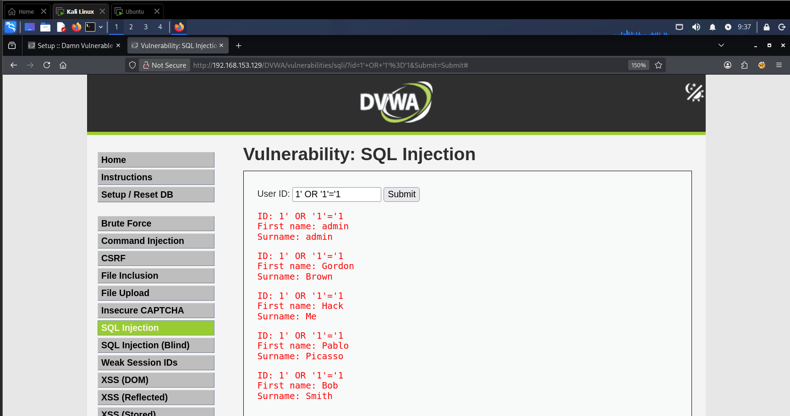
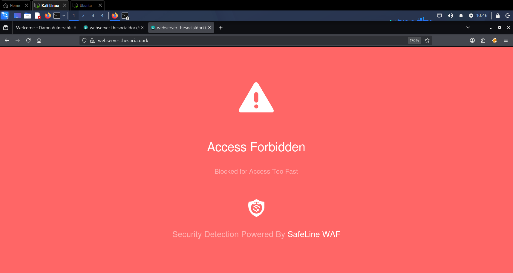
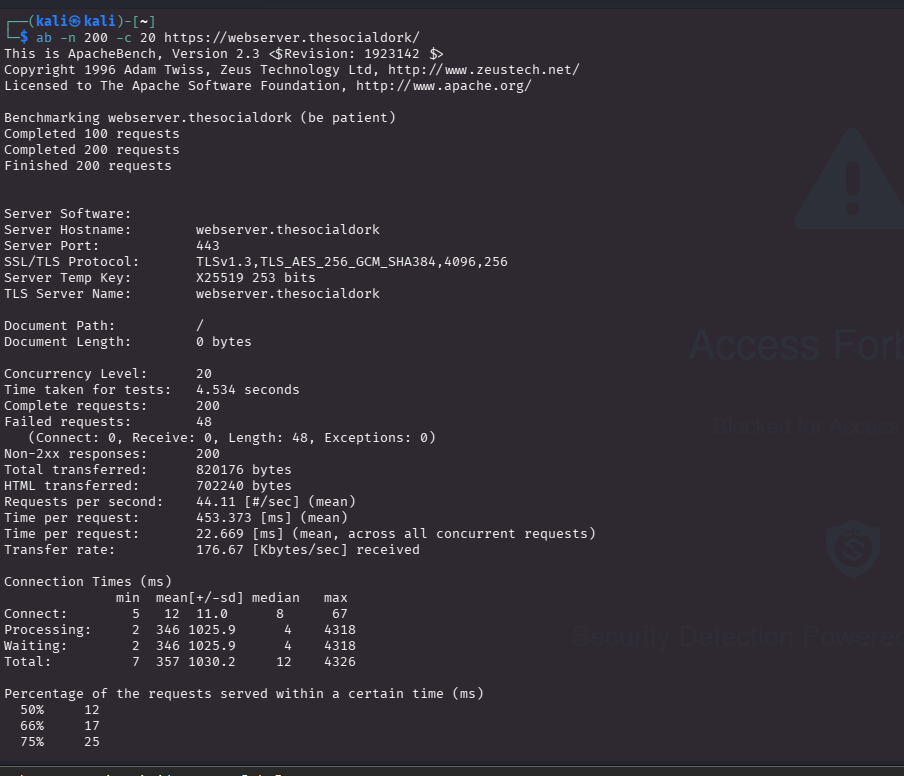
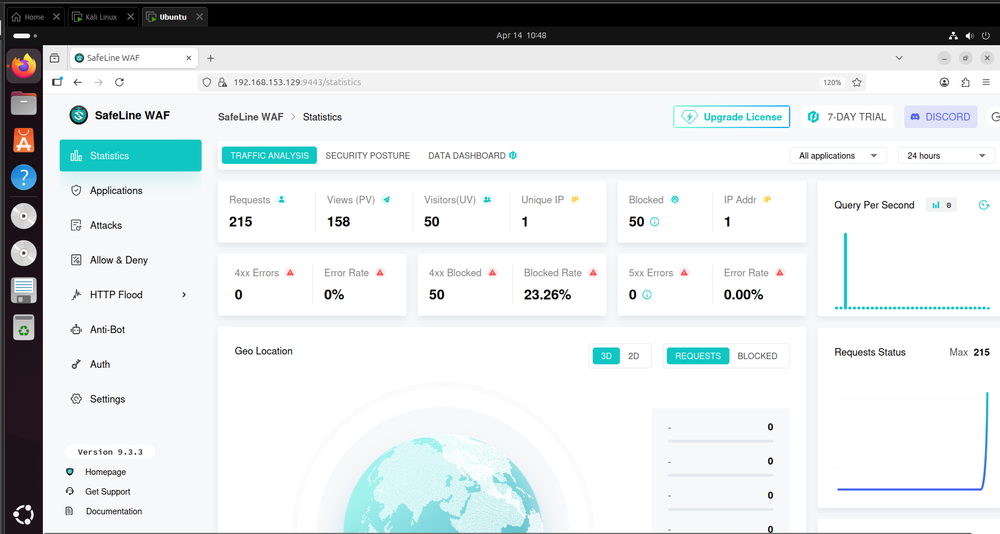

# 🔐 Web Application Firewall (WAF) Home Lab

## 📌 Overview
This project demonstrates the implementation of a Web Application Firewall using SafeLine to protect a web application from common attacks such as SQL Injection and HTTP Flood.

---

## 🛠️ Tech Stack
- SafeLine WAF
- Apache Web Server
- Kali Linux
- Ubuntu
- OpenSSL
- DVWA (Damn Vulnerable Web Application)

---

## 🧱 Architecture
Client → WAF → Web Server

---

## 🔐 Features Implemented
- SSL/TLS using OpenSSL
- Authentication setup
- Custom deny rules
- SQL Injection protection (built-in rules)
- HTTP flood protection (rate limiting)

---

## 🧪 Attack Simulation & Results

### 🔴 SQL Injection Attack (Before WAF)

---

### 🚫 WAF Blocking Malicious Request

---

### ⚡ HTTP Flood Simulation

---

### 📊 WAF Dashboard & Traffic Analysis

---

## 📊 Results
- Successfully blocked SQL injection attempts
- Prevented HTTP flood attacks using rate limiting
- Observed ~20–25% malicious traffic blocked
- Verified protection using WAF logs and dashboard

---

## 📚 Key Learnings
- Practical understanding of WAF
- Traffic filtering and rule configuration
- Attack simulation and validation
- Importance of layered security
